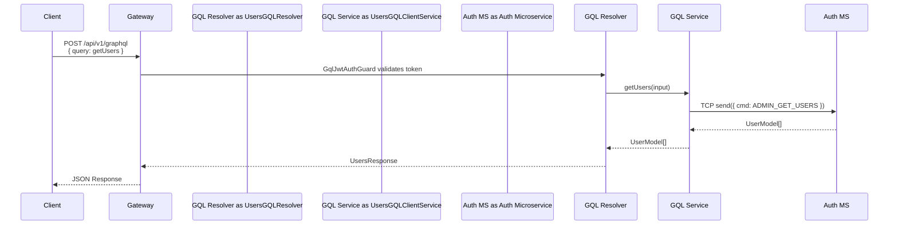
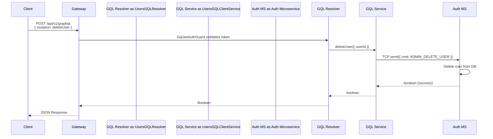
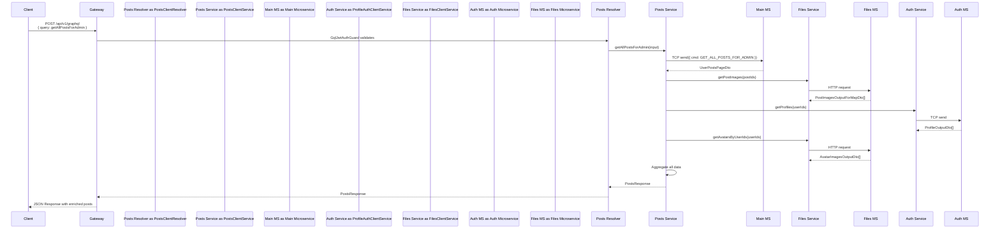
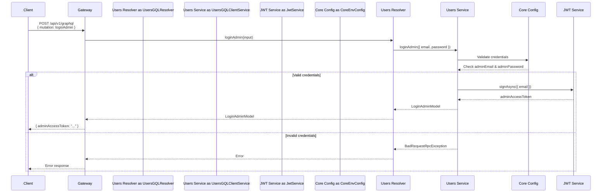

# GraphQL Documentation

## Overview

The Gateway service implements a GraphQL API using **NestJS**, **Apollo Server**, and **GraphQL Subscriptions** for real-time updates. This document describes the architecture, components, and how GraphQL is connected and used throughout the system.

## Table of Contents

1. [Architecture](#architecture)
2. [Setup & Configuration](#setup--configuration)
3. [GraphQL Modules](#graphql-modules)
4. [Resolvers](#resolvers)
5. [Authentication](#authentication)
6. [Real-time Subscriptions](#real-time-subscriptions)
7. [Sequence Diagrams](#sequence-diagrams)

---

## Architecture

The GraphQL implementation follows NestJS's GraphQL module pattern with:
- **Apollo Driver** for GraphQL server
- **Code-First Approach** using decorators
- **Auto Schema Generation** from TypeScript decorators
- **PubSub** for GraphQL subscriptions
- **Microservices Communication** via TCP clients

### Module Structure

```
apps/gateway/src/
├── core/
│   ├── graphql/
│   │   └── schema.gql (auto-generated)
│   └── core.module.ts (GraphQL setup)
├── microservices/
│   ├── auth/users_gql/ (Users resolver & service)
│   ├── main/posts_gql/ (Posts resolver)
│   └── payments/payments_gql/ (Payments resolver)
└── pubSubGql/
    └── pubSub-gql.module.ts (PubSub instance)
```

---

## Setup & Configuration

### GraphQL Module Configuration

Located in `apps/gateway/src/core/core.module.ts`:

```typescript
GraphQLModule.forRoot<ApolloDriverConfig>({
  driver: ApolloDriver,
  playground: true,                    // Enable GraphQL Playground
  path: "api/v1/graphql",              // Endpoint: /api/v1/graphql
  autoSchemaFile: join(process.cwd(), "apps/gateway/src/core/graphql/schema.gql"),
  sortSchema: true,                    // Sort schema alphabetically
  introspection: true,                 // Allow schema introspection in production
  context: ({ req, res }) => ({ req, res }),  // Pass request/response to context
  installSubscriptionHandlers: true,   // Enable subscriptions
  formatError: (error) => ({          // Custom error formatting
    message: error.message,
    originalError: error.extensions?.originalError,
  }),
})
```

### Key Configuration Points

1. **Playground**: Enabled for development/testing at `/api/v1/graphql`
2. **Schema Location**: Auto-generated at `apps/gateway/src/core/graphql/schema.gql`
3. **Context**: Provides access to HTTP request/response for authentication
4. **Subscriptions**: Enabled via `installSubscriptionHandlers: true`

---

## GraphQL Modules

### 1. PubSub Module

**Location**: `apps/gateway/src/pubSubGql/pubSub-gql.module.ts`

Provides a singleton PubSub instance for GraphQL subscriptions:

```typescript
@Module({
  providers: [{
    provide: PUB_SUB_GQL,
    useValue: new PubSub(),
  }],
  exports: [PUB_SUB_GQL],
})
export class PubSubGqlModule {}
```

**Usage**: Injected into resolvers/services that need to publish or subscribe to events.

### 2. Auth Client Module (Users GQL)

**Location**: `apps/gateway/src/microservices/auth/auth-client.module.ts`

Registers the Users resolver and service for admin operations:

```typescript
providers: [
  UsersGqlResolver,    // GraphQL resolver
  UsersGqlClientService, // Service for microservice communication
  // ... other providers
]
```

### 3. Main Client Module (Posts GQL)

**Location**: `apps/gateway/src/microservices/main/main-client.module.ts`

Includes:
- Posts resolver for admin post management
- PubSubGqlModule import for subscriptions
- Dependencies on Auth and Files clients

### 4. Payments Client Module (Payments GQL)

**Location**: `apps/gateway/src/microservices/payments/payments-client.module.ts`

Includes payments resolver for transaction queries.

---

## Resolvers

### Users Resolver

**Location**: `apps/gateway/src/microservices/auth/users_gql/users.resolver.ts`

**Operations**:
- `getUsers` (Query) - Paginated user list with filtering/sorting
- `deleteUser` (Mutation) - Delete a user account
- `setBlockStatusForUser` (Mutation) - Block/unblock users
- `loginAdmin` (Mutation) - Admin authentication

**Example**:
```typescript
@UseGuards(GqlJwtAuthGuard)
@Query(() => UsersResponse, { name: "getUsers" })
async getUsers(@Args("input") input: GetUsersInput) {
  return this.usersGqlClientService.getUsers(input);
}
```

### Posts Resolver

**Location**: `apps/gateway/src/microservices/main/posts_gql/posts-client.resolver.ts`

**Operations**:
- `getAllPostsForAdmin` (Query) - Get all posts with pagination
- `newPostAdded` (Subscription) - Real-time post notifications

**Special Features**:
- Aggregates data from multiple microservices (Main, Auth, Files)
- Enriches posts with profile info, images, and avatars
- Returns cursor-based pagination for efficient loading

### Payments Resolver

**Location**: `apps/gateway/src/microservices/payments/payments_gql/payments.resolver.ts`

**Operations**:
- `getPayments` (Query) - Get user transaction history

---

## Authentication

### GraphQL JWT Auth Guard

**Location**: `apps/gateway/src/core/guards/gql-jwt-auth.guard.ts`

Validates JWT tokens from the Authorization header in GraphQL context:

```typescript
async canActivate(context: ExecutionContext): Promise<boolean> {
  const ctx = GqlExecutionContext.create(context);
  const { req } = ctx.getContext();
  
  const authHeader = req.headers.authorization;
  if (!authHeader || !authHeader.startsWith("Bearer ")) {
    throw new UnauthorizedException("Missing or invalid Authorization header");
  }
  
  const token = authHeader.split(" ")[1];
  this.jwtService.verify(token);
  return true;
}
```

**Usage**: Apply to resolvers with `@UseGuards(GqlJwtAuthGuard)`

---

## Real-time Subscriptions

### Implementation

The system uses GraphQL subscriptions to notify clients when new posts are added.

#### 1. Subscription Setup

Defined in `PostsClientResolver`:

```typescript
@Subscription(() => PostModel, { name: "newPostAdded" })
newPostAdded() {
  return this.pubSub.asyncIterableIterator(GraphqlPubSubMessages.NEW_POST_ADDED);
}
```

#### 2. Event Publishing

When a post is uploaded (in `PostsClientService.uploadPostImages`):

```typescript
const post = await this.getPost(postId);
await this.pubSub.publish(GraphqlPubSubMessages.NEW_POST_ADDED, { newPostAdded: post });
```

#### 3. Subscription Flow

1. Client subscribes to `newPostAdded` subscription
2. Gatewy maintains WebSocket connection
3. When a new post is uploaded, the service publishes an event
4. All subscribed clients receive the new post data

---

## Sequence Diagrams

### Query Flow: Get Users



### Mutation Flow: Delete User



### Query Flow: Get Posts (With Data Aggregation)



### Subscription Flow: New Post Added

```mermaid
sequenceDiagram
    participant Client
    postseason Gateway
    participant Posts Resolver as PostsClientResolver
    participant Posts Service as PostsClientService
    participant PubSub
    participant Main MS as Main Microservice
    participant Files Service as FilesClientService

    Client->>Gateway: WebSocket: Subscribe to newPostAdded
    Gateway->>Posts Resolver: Register subscription
    Posts Resolver->>PubSub: asyncIterableIterator(NEW_POST_ADDED)
    
    Note over Client,Gateway: Subscription established, waiting for events...
    
    alt New post uploaded (via REST)
        Client->>Gateway: POST /api/v1/posts/:postId/images
        Gateway->>Posts Service: uploadPostImages(postId, req)
        Posts Service->>Main MS: getPost(postId)
        Main MS-->>Posts Service: PostOutputDto
        Posts Service->>Files Service: savePostImagesToDB()
        Files Service-->>Posts Service: success
        Posts Service->>PubSub: publish(NEW_POST_ADDED, { newPostAdded: post })
        PubSub->>Posts Resolver: Emit event to subscriber
        Posts Resolver-->>Gateway: Send to WebSocket
        Gateway-->>Client: WebSocket: Post data
    end
```

### Admin Login Flow



---

## GraphQL Schema

The schema is auto-generated from TypeScript decorators. Key types include:

### Queries
- `getUsers(input: GetUsersInput!)`: User management queries
- `getAllPostsForAdmin(input: GetAdminPostsInput!)`: Post listings
- `getPayments(input: GetPaymentsInput!)`: Transaction queries

### Mutations
- `deleteUser(input: DeleteUserInput!)`: Delete user
- `setBlockStatusForUser(input: SetBlockStatusForUserInput!)`: Block/unblock user
- `loginAdmin(input: LoginAdminInput!)`: Admin authentication

### Subscriptions
- `newPostAdded`: Real-time post notifications

### Input Types
- `GetUsersInput`: Pagination, filtering, sorting for users
- `DeleteUserInput`: User ID for deletion
- `SetBlockStatusForUserInput`: User ID, block status, reason
- `LoginAdminInput`: Email and password

### Output Types
- `UsersResponse`: Paginated user list
- `PostsResponse`: Paginated posts with pagination info
- `TransactionsResponse`: Transaction history
- `LoginAdminModel`: Admin access token

---

## Key Features

### 1. Code-First Approach
- TypeScript decorators define schema
- Type safety with TypeScript
- Auto-generated schema file

### 2. Microservices Integration
- Resolvers communicate with backend services via TCP
- Data aggregation from multiple sources
- Service-to-service communication abstracted

### 3. Authentication
- JWT-based authentication
- Guard-based protection on resolvers
- Context-aware request handling

### 4. Real-time Updates
- GraphQL subscriptions via WebSocket
- PubSub pattern for event publishing
- Efficient event distribution

### 5. Error Handling
- Custom error formatting
- RPC exception handling
- Graceful degradation

---

## Access Points

- **GraphQL Endpoint**: `http://host:port/api/v1/graphql`
- **GraphQL Playground**: `http://host:port/api/v1/graphql` (browser)
- **Schema File**: `apps/gateway/src/core/graphql/schema.gql`

---

## Testing

To test GraphQL queries:

1. **Using Playground**: Visit `/api/v1/graphql` in browser
2. **Example Query**:
```graphql
query {
  getUsers(input: { pageNumber: 1, pageSize: 10 }) {
    items {
      id
      userName
      isBlocked
    }
    totalCount
  }
}
```

3. **Example Mutation**:
```graphql
mutation {
  loginAdmin(input: { email: "admin@example.com", password: "password" }) {
    adminAccessToken
  }
}
```

4. **Example Subscription**:
```graphql
subscription {
  newPostAdded {
    id
    description
    ownerId
  }
}
```

---

## Future Enhancements

Potential improvements:
- Add more GraphQL operations (likes, comments, etc.)
- Implement DataLoader for batch optimization
- Add GraphQL fragment support
- Implement caching strategies
- Add rate limiting per query complexity
- Support for File uploads via GraphQL

---

## Dependencies

Key packages:
- `@nestjs/graphql`: GraphQL integration for NestJS
- `@nestjs/apollo`: Apollo Server driver
- `graphql`: GraphQL core
- `graphql-subscriptions`: PubSub implementation
- `@nestjs/jwt`: JWT token validation
