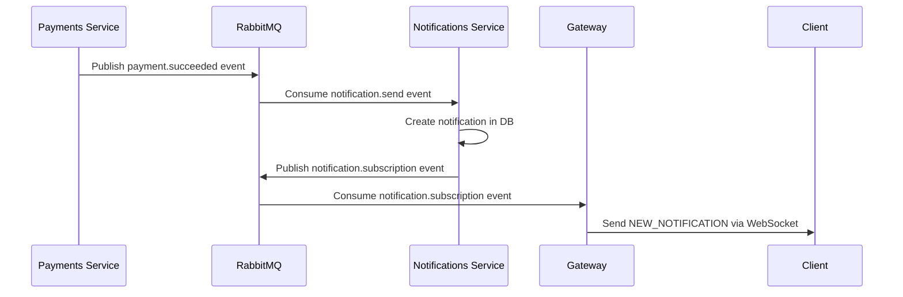

# WebSocket Implementation in Ulens Backend

## Overview

The Ulens backend implements a real-time notification system using WebSockets through Socket.IO. The WebSocket functionality is centralized in the Gateway service and provides real-time notifications to connected clients.

## Architecture

### Core Components

1. **WebsocketGateway** - Main WebSocket gateway handling connections and events
2. **WebsocketModule** - NestJS module configuration
3. **GatewayRabbitConsumer** - RabbitMQ consumer for processing notification events
4. **Utils** - Helper functions for room management

### File Structure

```
apps/gateway/src/websocket/
├── websocket.gateway.ts      # Main WebSocket gateway
├── websocket.module.ts       # Module configuration
├── websocket.config.ts       # Environment configuration
├── websocket.constants.ts    # Event constants
├── socket.d.ts              # TypeScript declarations
└── utils/
    └── getRoomByUserId.util.ts  # Room utility function
```

## Connection Flow

### 1. Client Connection

Clients connect to the WebSocket server using the `/ws` namespace:

```javascript
const socket = io('ws://localhost:3000/ws', {
  auth: {
    token: 'your-jwt-token'
  }
});
```

### 2. Authentication

Since NestJS guards don't work with Socket.IO, authentication is handled manually:

1. Client sends `SUBSCRIBE_NOTIFICATIONS` event with JWT token in handshake
2. Server verifies the JWT token using `JwtService`
3. If valid, extracts `userId` from token payload
4. Client joins a user-specific room: `user:{userId}:notifications`
5. If invalid, client is forcefully disconnected

### 3. Room Management

Each user gets their own notification room using the pattern:
```
user:{userId}:notifications
```

This ensures notifications are delivered only to the intended user.

## Events

### Client Events

| Event | Description | Payload |
|-------|-------------|---------|
| `SUBSCRIBE_NOTIFICATIONS` | Subscribe to notifications | JWT token in handshake auth |

### Server Events

| Event | Description | Payload |
|-------|-------------|---------|
| `NEW_NOTIFICATION` | New notification received | `NotificationDto` |
| `ERROR` | Connection/authentication error | Error message string |
| `TEST_NOTIFICATION` | Test notification (sent every 60s) | `{ message: "Hello, world!" }` |

## Notification Flow

### 1. Payment Success Flow



### 2. Event Processing

1. **Payments Service** publishes payment events to RabbitMQ
2. **Notifications Service** consumes events and:
   - Creates notification records in database
   - Publishes `NOTIFICATION_SUBSCRIPTION` events to gateway queue
3. **Gateway RabbitMQ Consumer** processes events and calls `sendNotificationToUser()`
4. **WebSocket Gateway** delivers notifications to user's room

## Configuration

### Environment Variables

```typescript
// Required environment variable
ACCESS_SECRET_KEY=your-jwt-secret-key
```

### JWT Configuration

The WebSocket module configures JWT with the access token secret for token verification:

```typescript
JwtModule.registerAsync({
  useFactory: (websocketEnvConfig: WebsocketEnvConfig) => ({
    secret: websocketEnvConfig.accessTokenSecret,
  }),
  inject: [WebsocketEnvConfig],
  extraProviders: [WebsocketEnvConfig],
})
```

## Data Structures

### NotificationDto

```typescript
export class NotificationDto {
  id: number;           // Notification ID
  message: string;      // Notification message
  sentAt: Date;         // When notification was sent
  readAt: Date | null;  // When notification was read (null if unread)
}
```

### RabbitMQ Event Structure

```typescript
{
  userId: string;
  userEmail: string;
  eventType: RabbitEvents.NOTIFICATION_SUBSCRIPTION;
  message: string;
  scheduledAt: null;
  notificationId: number;
  sentAt: Date;
  readAt: Date | null;
}
```

## Error Handling

### Authentication Errors

- Missing token: Client disconnected with "Missing token" error
- Invalid token: Client disconnected with "Invalid token" error
- JWT verification failure: Client disconnected with error details

### Connection Management

- Automatic reconnection handled by Socket.IO client
- Server logs all connection/disconnection events
- User-specific disconnection logging when `userId` is available

## Testing

The system includes a test notification that is sent every 60 seconds to all connected clients:

```typescript
setInterval(() => {
  this.server.emit(WebsocketEvents.TEST_NOTIFICATION, {
    message: "Hello, world!",
  });
}, 60_000);
```

## Integration Points

### Gateway Module Integration

The WebSocket module is imported into the main Gateway module:

```typescript
@Module({
  imports: [
    // ... other modules
    WebsocketModule,
    GatewayRabbitModule,
  ],
})
export class GatewayModule {}
```

### RabbitMQ Integration

The Gateway RabbitMQ consumer uses the WebSocket gateway to send notifications:

```typescript
@Injectable()
export class GatewayRabbitConsumer {
  constructor(
    private readonly websocketGateway: WebsocketGateway,
  ) {}
  
  // Consumes notification events and forwards to WebSocket
}
```

## Security Considerations

1. **JWT Authentication**: All connections require valid JWT tokens
2. **Room Isolation**: Users can only receive notifications in their own rooms
3. **Token Verification**: Server-side JWT verification prevents unauthorized access
4. **Force Disconnect**: Invalid tokens result in immediate disconnection

## Monitoring and Logging

The system provides comprehensive logging:

- Connection/disconnection events
- Authentication attempts
- Notification delivery attempts
- RabbitMQ event consumption
- Error conditions

All logs are prefixed with `[GATEWAY][WS]` for easy identification.

## Future Enhancements

Potential improvements could include:

1. **Connection Persistence**: Store user connections in Redis for horizontal scaling
2. **Message Queuing**: Queue messages for offline users
3. **Read Receipts**: Implement notification read status updates
4. **Rate Limiting**: Add connection rate limiting
5. **Metrics**: Add WebSocket connection metrics and monitoring
